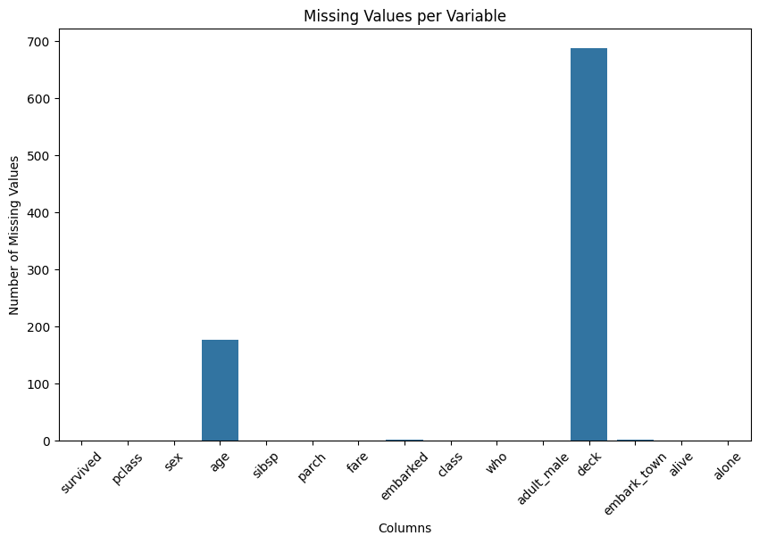
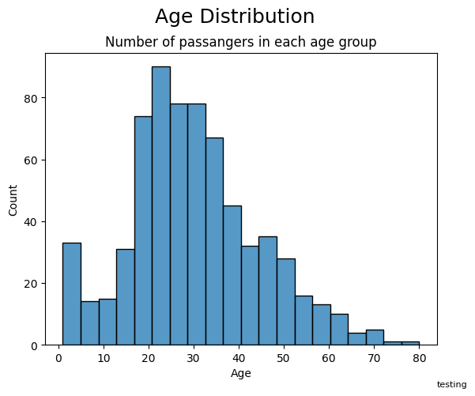
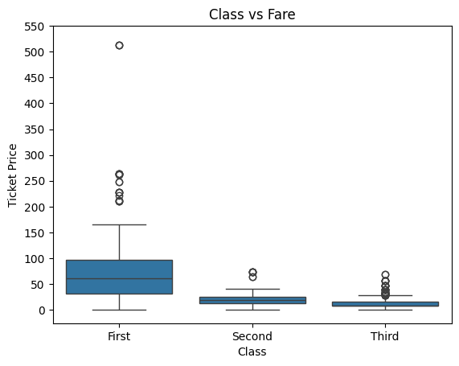
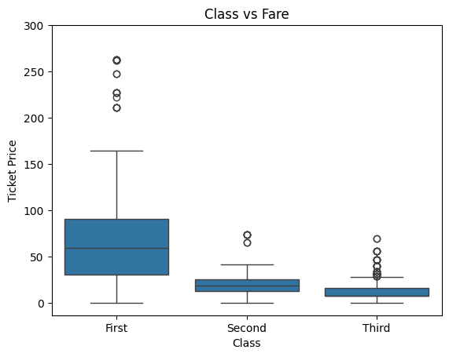
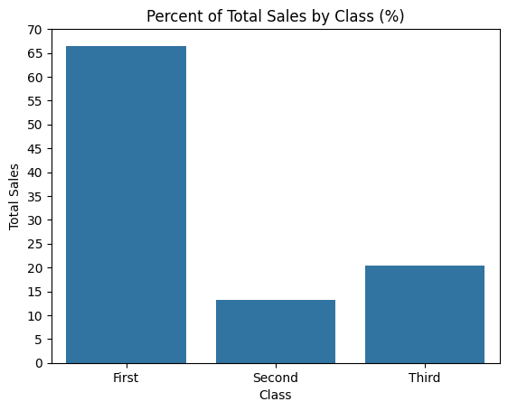
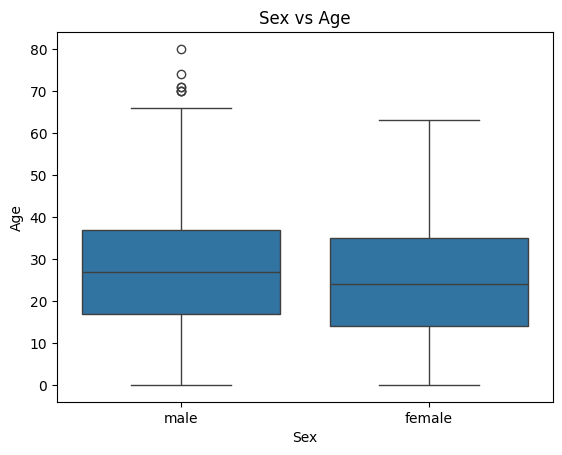
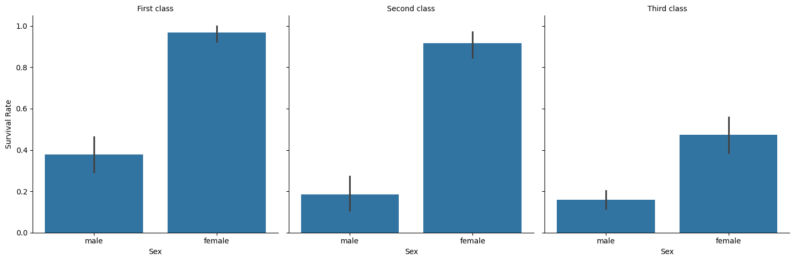

# Titanic Dataset Exploration
***

# 0 - Importing modules and titanic dataset
***


```python
import numpy as np
import pandas as pd
import seaborn as sns
import matplotlib.pyplot as plt
pd.set_option("display.max_rows", 10) 
titanic = sns.load_dataset("titanic")
display(titanic)
missing_values = titanic.isnull().sum()
missing_values
```


<div>
<style scoped>
    .dataframe tbody tr th:only-of-type {
        vertical-align: middle;
    }

    .dataframe tbody tr th {
        vertical-align: top;
    }

    .dataframe thead th {
        text-align: right;
    }
</style>
<table border="1" class="dataframe">
  <thead>
    <tr style="text-align: right;">
      <th></th>
      <th>survived</th>
      <th>pclass</th>
      <th>sex</th>
      <th>age</th>
      <th>sibsp</th>
      <th>parch</th>
      <th>fare</th>
      <th>embarked</th>
      <th>class</th>
      <th>who</th>
      <th>adult_male</th>
      <th>deck</th>
      <th>embark_town</th>
      <th>alive</th>
      <th>alone</th>
    </tr>
  </thead>
  <tbody>
    <tr>
      <th>0</th>
      <td>0</td>
      <td>3</td>
      <td>male</td>
      <td>22.0</td>
      <td>1</td>
      <td>0</td>
      <td>7.2500</td>
      <td>S</td>
      <td>Third</td>
      <td>man</td>
      <td>True</td>
      <td>NaN</td>
      <td>Southampton</td>
      <td>no</td>
      <td>False</td>
    </tr>
    <tr>
      <th>1</th>
      <td>1</td>
      <td>1</td>
      <td>female</td>
      <td>38.0</td>
      <td>1</td>
      <td>0</td>
      <td>71.2833</td>
      <td>C</td>
      <td>First</td>
      <td>woman</td>
      <td>False</td>
      <td>C</td>
      <td>Cherbourg</td>
      <td>yes</td>
      <td>False</td>
    </tr>
    <tr>
      <th>2</th>
      <td>1</td>
      <td>3</td>
      <td>female</td>
      <td>26.0</td>
      <td>0</td>
      <td>0</td>
      <td>7.9250</td>
      <td>S</td>
      <td>Third</td>
      <td>woman</td>
      <td>False</td>
      <td>NaN</td>
      <td>Southampton</td>
      <td>yes</td>
      <td>True</td>
    </tr>
    <tr>
      <th>3</th>
      <td>1</td>
      <td>1</td>
      <td>female</td>
      <td>35.0</td>
      <td>1</td>
      <td>0</td>
      <td>53.1000</td>
      <td>S</td>
      <td>First</td>
      <td>woman</td>
      <td>False</td>
      <td>C</td>
      <td>Southampton</td>
      <td>yes</td>
      <td>False</td>
    </tr>
    <tr>
      <th>4</th>
      <td>0</td>
      <td>3</td>
      <td>male</td>
      <td>35.0</td>
      <td>0</td>
      <td>0</td>
      <td>8.0500</td>
      <td>S</td>
      <td>Third</td>
      <td>man</td>
      <td>True</td>
      <td>NaN</td>
      <td>Southampton</td>
      <td>no</td>
      <td>True</td>
    </tr>
    <tr>
      <th>...</th>
      <td>...</td>
      <td>...</td>
      <td>...</td>
      <td>...</td>
      <td>...</td>
      <td>...</td>
      <td>...</td>
      <td>...</td>
      <td>...</td>
      <td>...</td>
      <td>...</td>
      <td>...</td>
      <td>...</td>
      <td>...</td>
      <td>...</td>
    </tr>
    <tr>
      <th>886</th>
      <td>0</td>
      <td>2</td>
      <td>male</td>
      <td>27.0</td>
      <td>0</td>
      <td>0</td>
      <td>13.0000</td>
      <td>S</td>
      <td>Second</td>
      <td>man</td>
      <td>True</td>
      <td>NaN</td>
      <td>Southampton</td>
      <td>no</td>
      <td>True</td>
    </tr>
    <tr>
      <th>887</th>
      <td>1</td>
      <td>1</td>
      <td>female</td>
      <td>19.0</td>
      <td>0</td>
      <td>0</td>
      <td>30.0000</td>
      <td>S</td>
      <td>First</td>
      <td>woman</td>
      <td>False</td>
      <td>B</td>
      <td>Southampton</td>
      <td>yes</td>
      <td>True</td>
    </tr>
    <tr>
      <th>888</th>
      <td>0</td>
      <td>3</td>
      <td>female</td>
      <td>NaN</td>
      <td>1</td>
      <td>2</td>
      <td>23.4500</td>
      <td>S</td>
      <td>Third</td>
      <td>woman</td>
      <td>False</td>
      <td>NaN</td>
      <td>Southampton</td>
      <td>no</td>
      <td>False</td>
    </tr>
    <tr>
      <th>889</th>
      <td>1</td>
      <td>1</td>
      <td>male</td>
      <td>26.0</td>
      <td>0</td>
      <td>0</td>
      <td>30.0000</td>
      <td>C</td>
      <td>First</td>
      <td>man</td>
      <td>True</td>
      <td>C</td>
      <td>Cherbourg</td>
      <td>yes</td>
      <td>True</td>
    </tr>
    <tr>
      <th>890</th>
      <td>0</td>
      <td>3</td>
      <td>male</td>
      <td>32.0</td>
      <td>0</td>
      <td>0</td>
      <td>7.7500</td>
      <td>Q</td>
      <td>Third</td>
      <td>man</td>
      <td>True</td>
      <td>NaN</td>
      <td>Queenstown</td>
      <td>no</td>
      <td>True</td>
    </tr>
  </tbody>
</table>
<p>891 rows × 15 columns</p>
</div>


    survived         0
    pclass           0
    sex              0
    age            177
    sibsp            0
                  ... 
    adult_male       0
    deck           688
    embark_town      2
    alive            0
    alone            0
    Length: 15, dtype: int64


# 1 - Data Cleaning


```python
pd.isnull(titanic)
```


<div>
<style scoped>
    .dataframe tbody tr th:only-of-type {
        vertical-align: middle;
    }

    .dataframe tbody tr th {
        vertical-align: top;
    }

    .dataframe thead th {
        text-align: right;
    }
</style>
<table border="1" class="dataframe">
  <thead>
    <tr style="text-align: right;">
      <th></th>
      <th>survived</th>
      <th>pclass</th>
      <th>sex</th>
      <th>age</th>
      <th>sibsp</th>
      <th>parch</th>
      <th>fare</th>
      <th>embarked</th>
      <th>class</th>
      <th>who</th>
      <th>adult_male</th>
      <th>deck</th>
      <th>embark_town</th>
      <th>alive</th>
      <th>alone</th>
    </tr>
  </thead>
  <tbody>
    <tr>
      <th>0</th>
      <td>False</td>
      <td>False</td>
      <td>False</td>
      <td>False</td>
      <td>False</td>
      <td>False</td>
      <td>False</td>
      <td>False</td>
      <td>False</td>
      <td>False</td>
      <td>False</td>
      <td>True</td>
      <td>False</td>
      <td>False</td>
      <td>False</td>
    </tr>
    <tr>
      <th>1</th>
      <td>False</td>
      <td>False</td>
      <td>False</td>
      <td>False</td>
      <td>False</td>
      <td>False</td>
      <td>False</td>
      <td>False</td>
      <td>False</td>
      <td>False</td>
      <td>False</td>
      <td>False</td>
      <td>False</td>
      <td>False</td>
      <td>False</td>
    </tr>
    <tr>
      <th>2</th>
      <td>False</td>
      <td>False</td>
      <td>False</td>
      <td>False</td>
      <td>False</td>
      <td>False</td>
      <td>False</td>
      <td>False</td>
      <td>False</td>
      <td>False</td>
      <td>False</td>
      <td>True</td>
      <td>False</td>
      <td>False</td>
      <td>False</td>
    </tr>
    <tr>
      <th>3</th>
      <td>False</td>
      <td>False</td>
      <td>False</td>
      <td>False</td>
      <td>False</td>
      <td>False</td>
      <td>False</td>
      <td>False</td>
      <td>False</td>
      <td>False</td>
      <td>False</td>
      <td>False</td>
      <td>False</td>
      <td>False</td>
      <td>False</td>
    </tr>
    <tr>
      <th>4</th>
      <td>False</td>
      <td>False</td>
      <td>False</td>
      <td>False</td>
      <td>False</td>
      <td>False</td>
      <td>False</td>
      <td>False</td>
      <td>False</td>
      <td>False</td>
      <td>False</td>
      <td>True</td>
      <td>False</td>
      <td>False</td>
      <td>False</td>
    </tr>
    <tr>
      <th>...</th>
      <td>...</td>
      <td>...</td>
      <td>...</td>
      <td>...</td>
      <td>...</td>
      <td>...</td>
      <td>...</td>
      <td>...</td>
      <td>...</td>
      <td>...</td>
      <td>...</td>
      <td>...</td>
      <td>...</td>
      <td>...</td>
      <td>...</td>
    </tr>
    <tr>
      <th>886</th>
      <td>False</td>
      <td>False</td>
      <td>False</td>
      <td>False</td>
      <td>False</td>
      <td>False</td>
      <td>False</td>
      <td>False</td>
      <td>False</td>
      <td>False</td>
      <td>False</td>
      <td>True</td>
      <td>False</td>
      <td>False</td>
      <td>False</td>
    </tr>
    <tr>
      <th>887</th>
      <td>False</td>
      <td>False</td>
      <td>False</td>
      <td>False</td>
      <td>False</td>
      <td>False</td>
      <td>False</td>
      <td>False</td>
      <td>False</td>
      <td>False</td>
      <td>False</td>
      <td>False</td>
      <td>False</td>
      <td>False</td>
      <td>False</td>
    </tr>
    <tr>
      <th>888</th>
      <td>False</td>
      <td>False</td>
      <td>False</td>
      <td>True</td>
      <td>False</td>
      <td>False</td>
      <td>False</td>
      <td>False</td>
      <td>False</td>
      <td>False</td>
      <td>False</td>
      <td>True</td>
      <td>False</td>
      <td>False</td>
      <td>False</td>
    </tr>
    <tr>
      <th>889</th>
      <td>False</td>
      <td>False</td>
      <td>False</td>
      <td>False</td>
      <td>False</td>
      <td>False</td>
      <td>False</td>
      <td>False</td>
      <td>False</td>
      <td>False</td>
      <td>False</td>
      <td>False</td>
      <td>False</td>
      <td>False</td>
      <td>False</td>
    </tr>
    <tr>
      <th>890</th>
      <td>False</td>
      <td>False</td>
      <td>False</td>
      <td>False</td>
      <td>False</td>
      <td>False</td>
      <td>False</td>
      <td>False</td>
      <td>False</td>
      <td>False</td>
      <td>False</td>
      <td>True</td>
      <td>False</td>
      <td>False</td>
      <td>False</td>
    </tr>
  </tbody>
</table>
<p>891 rows × 15 columns</p>
</div>


```python
titanic.info()
missing_values = titanic.isnull().sum()
plt.figure(figsize=(10, 6))
sns.barplot(x=missing_values.index, y=missing_values.values)
plt.xticks(rotation=45)  # Rotate the x-axis labels for better readability
plt.xlabel('Columns')
plt.ylabel('Number of Missing Values')
plt.title('Missing Values per Variable')
```

    <class 'pandas.core.frame.DataFrame'>
    RangeIndex: 891 entries, 0 to 890
    Data columns (total 15 columns):
     #   Column       Non-Null Count  Dtype   
    ---  ------       --------------  -----   
     0   survived     891 non-null    int64   
     1   pclass       891 non-null    int64   
     2   sex          891 non-null    object  
     3   age          714 non-null    float64 
     4   sibsp        891 non-null    int64   
     5   parch        891 non-null    int64   
     6   fare         891 non-null    float64 
     7   embarked     889 non-null    object  
     8   class        891 non-null    category
     9   who          891 non-null    object  
     10  adult_male   891 non-null    bool    
     11  deck         203 non-null    category
     12  embark_town  889 non-null    object  
     13  alive        891 non-null    object  
     14  alone        891 non-null    bool    
    dtypes: bool(2), category(2), float64(2), int64(4), object(5)
    memory usage: 80.7+ KB
    


    Text(0.5, 1.0, 'Missing Values per Variable')


    

    


### Due to the high number of missing values in the 'deck' column it is best to remove this from the dataframe  


```python
titanic = titanic.drop("deck", axis = 1)
```


```python
titanic.duplicated().sum()
```


    111


```python
titanic = titanic.drop_duplicates()
```

### 111 rows of duplicated data that can be dropped

### Age does not have as many missing values and it may not be appropriate to remove these rows.<br><br> However the 'ages' column has floats and some ages are .5 which needs to be changed. To do this the NaN values must be filled.


```python
titanic["age"] = titanic["age"].fillna(0)
titanic["age"] = titanic["age"].astype(int)
titanic
```


<div>
<style scoped>
    .dataframe tbody tr th:only-of-type {
        vertical-align: middle;
    }

    .dataframe tbody tr th {
        vertical-align: top;
    }

    .dataframe thead th {
        text-align: right;
    }
</style>
<table border="1" class="dataframe">
  <thead>
    <tr style="text-align: right;">
      <th></th>
      <th>survived</th>
      <th>pclass</th>
      <th>sex</th>
      <th>age</th>
      <th>sibsp</th>
      <th>parch</th>
      <th>fare</th>
      <th>embarked</th>
      <th>class</th>
      <th>who</th>
      <th>adult_male</th>
      <th>embark_town</th>
      <th>alive</th>
      <th>alone</th>
    </tr>
  </thead>
  <tbody>
    <tr>
      <th>0</th>
      <td>0</td>
      <td>3</td>
      <td>male</td>
      <td>22</td>
      <td>1</td>
      <td>0</td>
      <td>7.2500</td>
      <td>S</td>
      <td>Third</td>
      <td>man</td>
      <td>True</td>
      <td>Southampton</td>
      <td>no</td>
      <td>False</td>
    </tr>
    <tr>
      <th>1</th>
      <td>1</td>
      <td>1</td>
      <td>female</td>
      <td>38</td>
      <td>1</td>
      <td>0</td>
      <td>71.2833</td>
      <td>C</td>
      <td>First</td>
      <td>woman</td>
      <td>False</td>
      <td>Cherbourg</td>
      <td>yes</td>
      <td>False</td>
    </tr>
    <tr>
      <th>2</th>
      <td>1</td>
      <td>3</td>
      <td>female</td>
      <td>26</td>
      <td>0</td>
      <td>0</td>
      <td>7.9250</td>
      <td>S</td>
      <td>Third</td>
      <td>woman</td>
      <td>False</td>
      <td>Southampton</td>
      <td>yes</td>
      <td>True</td>
    </tr>
    <tr>
      <th>3</th>
      <td>1</td>
      <td>1</td>
      <td>female</td>
      <td>35</td>
      <td>1</td>
      <td>0</td>
      <td>53.1000</td>
      <td>S</td>
      <td>First</td>
      <td>woman</td>
      <td>False</td>
      <td>Southampton</td>
      <td>yes</td>
      <td>False</td>
    </tr>
    <tr>
      <th>4</th>
      <td>0</td>
      <td>3</td>
      <td>male</td>
      <td>35</td>
      <td>0</td>
      <td>0</td>
      <td>8.0500</td>
      <td>S</td>
      <td>Third</td>
      <td>man</td>
      <td>True</td>
      <td>Southampton</td>
      <td>no</td>
      <td>True</td>
    </tr>
    <tr>
      <th>...</th>
      <td>...</td>
      <td>...</td>
      <td>...</td>
      <td>...</td>
      <td>...</td>
      <td>...</td>
      <td>...</td>
      <td>...</td>
      <td>...</td>
      <td>...</td>
      <td>...</td>
      <td>...</td>
      <td>...</td>
      <td>...</td>
    </tr>
    <tr>
      <th>885</th>
      <td>0</td>
      <td>3</td>
      <td>female</td>
      <td>39</td>
      <td>0</td>
      <td>5</td>
      <td>29.1250</td>
      <td>Q</td>
      <td>Third</td>
      <td>woman</td>
      <td>False</td>
      <td>Queenstown</td>
      <td>no</td>
      <td>False</td>
    </tr>
    <tr>
      <th>887</th>
      <td>1</td>
      <td>1</td>
      <td>female</td>
      <td>19</td>
      <td>0</td>
      <td>0</td>
      <td>30.0000</td>
      <td>S</td>
      <td>First</td>
      <td>woman</td>
      <td>False</td>
      <td>Southampton</td>
      <td>yes</td>
      <td>True</td>
    </tr>
    <tr>
      <th>888</th>
      <td>0</td>
      <td>3</td>
      <td>female</td>
      <td>0</td>
      <td>1</td>
      <td>2</td>
      <td>23.4500</td>
      <td>S</td>
      <td>Third</td>
      <td>woman</td>
      <td>False</td>
      <td>Southampton</td>
      <td>no</td>
      <td>False</td>
    </tr>
    <tr>
      <th>889</th>
      <td>1</td>
      <td>1</td>
      <td>male</td>
      <td>26</td>
      <td>0</td>
      <td>0</td>
      <td>30.0000</td>
      <td>C</td>
      <td>First</td>
      <td>man</td>
      <td>True</td>
      <td>Cherbourg</td>
      <td>yes</td>
      <td>True</td>
    </tr>
    <tr>
      <th>890</th>
      <td>0</td>
      <td>3</td>
      <td>male</td>
      <td>32</td>
      <td>0</td>
      <td>0</td>
      <td>7.7500</td>
      <td>Q</td>
      <td>Third</td>
      <td>man</td>
      <td>True</td>
      <td>Queenstown</td>
      <td>no</td>
      <td>True</td>
    </tr>
  </tbody>
</table>
<p>780 rows × 14 columns</p>
</div>


### There are quite a few columns that display duplicated data that can be removed. embarked is derived from embark_town, alone is detrimined by both sibsp(# of siblings or spouses on board) and parch(#number of parents or children on board) being 0, pclass (ticket class) and class are the same, alive does not seem relevant if survived is present. Who is determined by sex and age, which is the same for how is determined adult_male.


```python
titanic = titanic.drop("pclass", axis = 1)
titanic = titanic.drop("embarked", axis = 1)
titanic = titanic.drop("alive", axis = 1)
titanic = titanic.drop("alone", axis = 1)
titanic = titanic.drop("adult_male", axis = 1)
titanic = titanic.drop("who", axis = 1)
titanic
```


<div>
<style scoped>
    .dataframe tbody tr th:only-of-type {
        vertical-align: middle;
    }

    .dataframe tbody tr th {
        vertical-align: top;
    }

    .dataframe thead th {
        text-align: right;
    }
</style>
<table border="1" class="dataframe">
  <thead>
    <tr style="text-align: right;">
      <th></th>
      <th>survived</th>
      <th>sex</th>
      <th>age</th>
      <th>sibsp</th>
      <th>parch</th>
      <th>fare</th>
      <th>class</th>
      <th>embark_town</th>
    </tr>
  </thead>
  <tbody>
    <tr>
      <th>0</th>
      <td>0</td>
      <td>male</td>
      <td>22</td>
      <td>1</td>
      <td>0</td>
      <td>7.2500</td>
      <td>Third</td>
      <td>Southampton</td>
    </tr>
    <tr>
      <th>1</th>
      <td>1</td>
      <td>female</td>
      <td>38</td>
      <td>1</td>
      <td>0</td>
      <td>71.2833</td>
      <td>First</td>
      <td>Cherbourg</td>
    </tr>
    <tr>
      <th>2</th>
      <td>1</td>
      <td>female</td>
      <td>26</td>
      <td>0</td>
      <td>0</td>
      <td>7.9250</td>
      <td>Third</td>
      <td>Southampton</td>
    </tr>
    <tr>
      <th>3</th>
      <td>1</td>
      <td>female</td>
      <td>35</td>
      <td>1</td>
      <td>0</td>
      <td>53.1000</td>
      <td>First</td>
      <td>Southampton</td>
    </tr>
    <tr>
      <th>4</th>
      <td>0</td>
      <td>male</td>
      <td>35</td>
      <td>0</td>
      <td>0</td>
      <td>8.0500</td>
      <td>Third</td>
      <td>Southampton</td>
    </tr>
    <tr>
      <th>...</th>
      <td>...</td>
      <td>...</td>
      <td>...</td>
      <td>...</td>
      <td>...</td>
      <td>...</td>
      <td>...</td>
      <td>...</td>
    </tr>
    <tr>
      <th>885</th>
      <td>0</td>
      <td>female</td>
      <td>39</td>
      <td>0</td>
      <td>5</td>
      <td>29.1250</td>
      <td>Third</td>
      <td>Queenstown</td>
    </tr>
    <tr>
      <th>887</th>
      <td>1</td>
      <td>female</td>
      <td>19</td>
      <td>0</td>
      <td>0</td>
      <td>30.0000</td>
      <td>First</td>
      <td>Southampton</td>
    </tr>
    <tr>
      <th>888</th>
      <td>0</td>
      <td>female</td>
      <td>0</td>
      <td>1</td>
      <td>2</td>
      <td>23.4500</td>
      <td>Third</td>
      <td>Southampton</td>
    </tr>
    <tr>
      <th>889</th>
      <td>1</td>
      <td>male</td>
      <td>26</td>
      <td>0</td>
      <td>0</td>
      <td>30.0000</td>
      <td>First</td>
      <td>Cherbourg</td>
    </tr>
    <tr>
      <th>890</th>
      <td>0</td>
      <td>male</td>
      <td>32</td>
      <td>0</td>
      <td>0</td>
      <td>7.7500</td>
      <td>Third</td>
      <td>Queenstown</td>
    </tr>
  </tbody>
</table>
<p>780 rows × 8 columns</p>
</div>


# 2 - Explanatory Data Analysis


```python
titanic.describe()
```


<div>
<style scoped>
    .dataframe tbody tr th:only-of-type {
        vertical-align: middle;
    }

    .dataframe tbody tr th {
        vertical-align: top;
    }

    .dataframe thead th {
        text-align: right;
    }
</style>
<table border="1" class="dataframe">
  <thead>
    <tr style="text-align: right;">
      <th></th>
      <th>survived</th>
      <th>age</th>
      <th>sibsp</th>
      <th>parch</th>
      <th>fare</th>
    </tr>
  </thead>
  <tbody>
    <tr>
      <th>count</th>
      <td>780.000000</td>
      <td>780.000000</td>
      <td>780.000000</td>
      <td>780.000000</td>
      <td>780.000000</td>
    </tr>
    <tr>
      <th>mean</th>
      <td>0.412821</td>
      <td>25.820513</td>
      <td>0.525641</td>
      <td>0.417949</td>
      <td>34.829108</td>
    </tr>
    <tr>
      <th>std</th>
      <td>0.492657</td>
      <td>17.054202</td>
      <td>0.988046</td>
      <td>0.838536</td>
      <td>52.263440</td>
    </tr>
    <tr>
      <th>min</th>
      <td>0.000000</td>
      <td>0.000000</td>
      <td>0.000000</td>
      <td>0.000000</td>
      <td>0.000000</td>
    </tr>
    <tr>
      <th>25%</th>
      <td>0.000000</td>
      <td>16.000000</td>
      <td>0.000000</td>
      <td>0.000000</td>
      <td>8.050000</td>
    </tr>
    <tr>
      <th>50%</th>
      <td>0.000000</td>
      <td>26.000000</td>
      <td>0.000000</td>
      <td>0.000000</td>
      <td>15.950000</td>
    </tr>
    <tr>
      <th>75%</th>
      <td>1.000000</td>
      <td>36.000000</td>
      <td>1.000000</td>
      <td>1.000000</td>
      <td>34.375000</td>
    </tr>
    <tr>
      <th>max</th>
      <td>1.000000</td>
      <td>80.000000</td>
      <td>8.000000</td>
      <td>6.000000</td>
      <td>512.329200</td>
    </tr>
  </tbody>
</table>
</div>


### The ages that were changed to 0 need to be removed so that they do not affect the average


```python
age = pd.DataFrame(titanic, columns=["age","class"])
age["age"] = age["age"].replace(0,np.nan)
age = age.dropna()
txt = "testing"
sns.histplot(data = age, x="age")
plt.xlabel('Age')
plt.ylabel('Count')
plt.suptitle("Age Distribution", y=1, fontsize=18)
plt.title("Number of passangers in each age group")
plt.figtext(0.9, 0, txt, wrap=False, horizontalalignment='left', fontsize=8)
```


    Text(0.9, 0, 'testing')


    

    


### We can see a positive skew for age. The most common age appearing to be between 20-25


```python
age.groupby("class", observed = True).mean()
```


<div>
<style scoped>
    .dataframe tbody tr th:only-of-type {
        vertical-align: middle;
    }

    .dataframe tbody tr th {
        vertical-align: top;
    }

    .dataframe thead th {
        text-align: right;
    }
</style>
<table border="1" class="dataframe">
  <thead>
    <tr style="text-align: right;">
      <th></th>
      <th>age</th>
    </tr>
    <tr>
      <th>class</th>
      <th></th>
    </tr>
  </thead>
  <tbody>
    <tr>
      <th>First</th>
      <td>38.382514</td>
    </tr>
    <tr>
      <th>Second</th>
      <td>30.412903</td>
    </tr>
    <tr>
      <th>Third</th>
      <td>25.307229</td>
    </tr>
  </tbody>
</table>
</div>


```python
fare = pd.DataFrame(titanic, columns=["fare","class"])
sns.boxplot(data = fare, x="class",y = "fare")
plt.yticks(np.arange(0,max(fare["fare"])+50,50))
plt.xlabel('Class')
plt.ylabel('Ticket Price')
plt.title('Class vs Fare')
fare.groupby("class", observed = True).mean(numeric_only = True)
```


<div>
<style scoped>
    .dataframe tbody tr th:only-of-type {
        vertical-align: middle;
    }

    .dataframe tbody tr th {
        vertical-align: top;
    }

    .dataframe thead th {
        text-align: right;
    }
</style>
<table border="1" class="dataframe">
  <thead>
    <tr style="text-align: right;">
      <th></th>
      <th>fare</th>
    </tr>
    <tr>
      <th>class</th>
      <th></th>
    </tr>
  </thead>
  <tbody>
    <tr>
      <th>First</th>
      <td>85.159631</td>
    </tr>
    <tr>
      <th>Second</th>
      <td>21.889279</td>
    </tr>
    <tr>
      <th>Third</th>
      <td>13.670843</td>
    </tr>
  </tbody>
</table>
</div>


    

    


### While all classes have some outliers, First class has a fairly extreme one that would impact the mean significantly. This can be removed and the mean recalculated


```python
fare= fare.drop(fare[fare["fare"] > 500].index)
sns.boxplot(data = fare, x="class",y = "fare")
plt.yticks(np.arange(0,max(fare["fare"])+50,50))
plt.xlabel('Class')
plt.ylabel('Ticket Price')
plt.title('Class vs Fare')
fare.groupby("class", observed = True).mean(numeric_only = True)
```


<div>
<style scoped>
    .dataframe tbody tr th:only-of-type {
        vertical-align: middle;
    }

    .dataframe tbody tr th {
        vertical-align: top;
    }

    .dataframe thead th {
        text-align: right;
    }
</style>
<table border="1" class="dataframe">
  <thead>
    <tr style="text-align: right;">
      <th></th>
      <th>fare</th>
    </tr>
    <tr>
      <th>class</th>
      <th></th>
    </tr>
  </thead>
  <tbody>
    <tr>
      <th>First</th>
      <td>79.028010</td>
    </tr>
    <tr>
      <th>Second</th>
      <td>21.889279</td>
    </tr>
    <tr>
      <th>Third</th>
      <td>13.670843</td>
    </tr>
  </tbody>
</table>
</div>


    

    


```python
total = titanic["fare"].sum()
titanic.insert(8,"Percent of Total Ticket Sales",(titanic["fare"]/total) * 100)
titanic
totalsales = titanic.groupby("class", observed = True)["Percent of Total Ticket Sales"].sum()
#print(totalsales)
#print(type(totalsales))
print(totalsales.reset_index())
#print(type(totalsales.reset_index()))
sns.barplot(data = totalsales.reset_index(), y = "Percent of Total Ticket Sales", x = "class")
plt.yticks(np.arange(0,70 + 5,5))
plt.xlabel('Class')
plt.ylabel('Total Sales')
plt.title('Percent of Total Sales by Class (%)')
```

        class  Percent of Total Ticket Sales
    0   First                      66.455768
    1  Second                      13.214123
    2   Third                      20.330109
    


    Text(0.5, 1.0, 'Percent of Total Sales by Class (%)')


    

    


```python
titanic["survived"].sum()
```


    322


```python
table = pd.crosstab(titanic['survived'],titanic['sex'])
table
```


<div>
<style scoped>
    .dataframe tbody tr th:only-of-type {
        vertical-align: middle;
    }

    .dataframe tbody tr th {
        vertical-align: top;
    }

    .dataframe thead th {
        text-align: right;
    }
</style>
<table border="1" class="dataframe">
  <thead>
    <tr style="text-align: right;">
      <th>sex</th>
      <th>female</th>
      <th>male</th>
    </tr>
    <tr>
      <th>survived</th>
      <th></th>
      <th></th>
    </tr>
  </thead>
  <tbody>
    <tr>
      <th>0</th>
      <td>76</td>
      <td>382</td>
    </tr>
    <tr>
      <th>1</th>
      <td>216</td>
      <td>106</td>
    </tr>
  </tbody>
</table>
</div>


### Females were about twice as likely to have survived compared to males


```python
table = pd.crosstab(titanic['survived'],titanic['class'])
table
```


<div>
<style scoped>
    .dataframe tbody tr th:only-of-type {
        vertical-align: middle;
    }

    .dataframe tbody tr th {
        vertical-align: top;
    }

    .dataframe thead th {
        text-align: right;
    }
</style>
<table border="1" class="dataframe">
  <thead>
    <tr style="text-align: right;">
      <th>class</th>
      <th>First</th>
      <th>Second</th>
      <th>Third</th>
    </tr>
    <tr>
      <th>survived</th>
      <th></th>
      <th></th>
      <th></th>
    </tr>
  </thead>
  <tbody>
    <tr>
      <th>0</th>
      <td>77</td>
      <td>81</td>
      <td>300</td>
    </tr>
    <tr>
      <th>1</th>
      <td>135</td>
      <td>83</td>
      <td>104</td>
    </tr>
  </tbody>
</table>
</div>


### First class had the most survivors 

## Data Visualisation
***


```python
sns.boxplot(data = titanic, x = "sex", y = "age")
plt.xlabel('Sex')
plt.ylabel('Age')
plt.title('Sex vs Age')
```


    Text(0.5, 1.0, 'Sex vs Age')


    

    


```python
survival_rates = sns.catplot(data=titanic, x="sex", y="survived", col="class",kind="bar")
survival_rates.set_axis_labels("Sex", "Survival Rate")
survival_rates.set_titles("{col_name} {col_var}")
```


    <seaborn.axisgrid.FacetGrid at 0x239904d4a40>


    

    


```python

```
